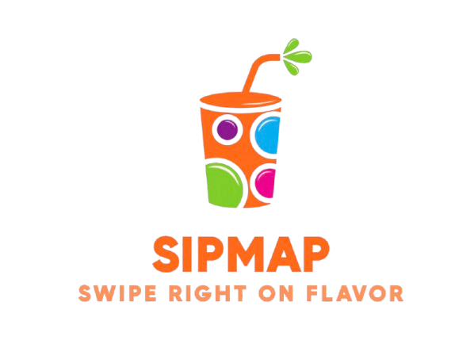

# SipMap

Swipe. Sip. Savor. 🍸

Discover the best cafes, bars, and drink spots in any city with a swipe! SipMap is a modern, minimalist web app designed for quick, delightful exploration of local flavors.

## Features

- **Swipeable Card Stack:** Effortlessly browse venues with left/right swipes.
- **Mini Rating Stars:** See friendly star ratings at a glance.
- **Save & Reject:** Heart your favorites, reject the rest—your choices are remembered.
- **Surprise Me:** Feeling indecisive? Let SipMap pick a random spot for you!
- **Skeleton Loading:** Enjoy smooth, animated loading states for instant feedback.
- **Search Anywhere:** Find cafes by city, drink, or location.
- **Responsive & Fast:** Works beautifully on mobile and desktop.

## How It Works

1. **Search** for a city or drink.
2. **Swipe** through curated venues.
3. **Save** your favorites with a tap.
4. **Surprise Me** for a random pick.
5. **Enjoy** your next sip adventure!

## Screenshots



## Tech Stack

- HTML5, CSS3, JavaScript (Vanilla)
- Font Awesome for icons
- Hammer.js for swipe gestures
- Responsive, accessible design

## Getting Started

1. **Clone the repo:**
   ```bash
   git clone https://github.com/MeHalogen/SipMap.git
   ```
2. **Open `index.html` in your browser.**
3. **(Optional) Start the backend server** for live cafe data.

## Customization

- Change the logo in `/images/image.png`.
- Tweak colors and styles in `styles.css`.
- Add new features in `script.js`.

## Contributing

Pull requests and suggestions are welcome! Open an issue or submit a PR to help make SipMap even better.

## License

MIT

---

Made with ❤️ for flavor explorers everywhere.